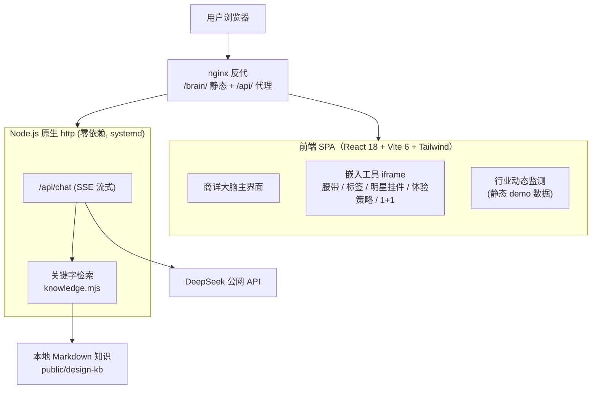
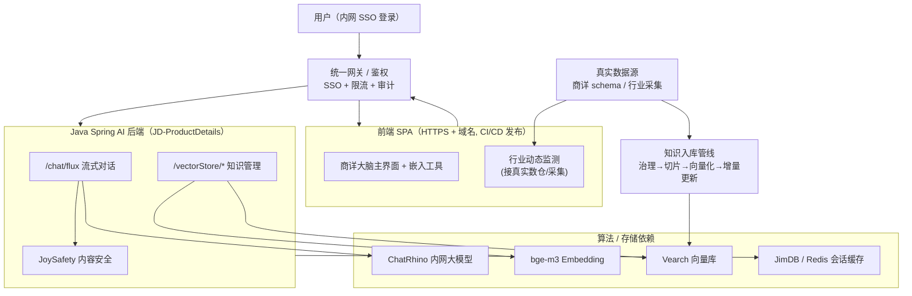

# 商详大脑 · 后续落地技术依赖清单

> 本文梳理「商详大脑」从当前 Demo 形态走向正式生产落地所需的技术依赖项，分**现状**与**落地补齐**两部分，并附架构对比图。
>
> 更新时间：2026-06-08

---

## 一、当前已有的技术栈（Demo 形态）

| 层 | 现状 | 说明 |
|---|---|---|
| 前端 | React 18.3 + Vite 6 + Tailwind 3 | 纯静态 SPA，`base: './'`，部署在 `/brain/` 子路径 |
| 嵌入工具 | 多个 iframe（腰带 / 标签 / 明星挂件 / 体验策略 / 1+1 配图） | 各自 HTML，部分基于 Ant Design |
| AI 后端 | Node.js 原生 `http`（零依赖）`server/index.mjs` | SSE 流式 `/api/chat` + `/api/health` |
| RAG 检索 | 本地 Markdown + **关键字匹配**（中文双字切分）`server/knowledge.mjs` | 非向量检索，按词命中打分 |
| LLM | **DeepSeek 公网 API**（`deepseek-chat`） | 通过 `.env` 的 `DEEPSEEK_API_KEY` 调用 |
| 部署 | 单机 `111.228.7.174` + nginx 反代 + systemd 常驻 | nginx `/api/` → `127.0.0.1:8787` |
| 知识源 | `public/design-kb/knowledge/*.md`、`public/design-schema/*.json`、`public/pics/` | 静态文件，手动更新 |

---

## 二、正式落地需要补齐的依赖项

### 1. LLM 与算法服务（最关键，涉及合规）
- **替换 DeepSeek 公网 → 京东内部大模型**：`JD-ProductDetails` 的 Spring AI 后端已对接 **ChatRhino（言犀）**，落地应走内网模型，避免设计资料出公网。
- **Embedding 模型**：`bge-m3`（语义向量化），替换当前关键字检索。
- **内容安全**：`JoySafety` 输入 / 输出审核（合规必需）。

### 2. 检索 / 存储（从"关键字"升级到"向量 RAG"）
- **向量库 Vearch**：存放知识切片向量，支持语义召回（替换 `searchKnowledge` 关键字逻辑）。
- **JimDB / Redis**：会话上下文、缓存、限流。
- **知识入库管线**：文档治理 → 切片 → 向量化 → 增量更新（当前是手动 cp markdown，需自动化）。

### 3. 后端服务化
- 现在是零依赖 Node 单进程 Demo；落地建议二选一：
  - **直接接入 Java Spring AI 后端**（`JD-ProductDetails`，已有 `/chat/flux`、`/vectorStore/*`），Node 仅做 BFF / 代理；
  - 或 Node 升级为正式服务（鉴权、日志、限流、健康检查、可观测）。
- **鉴权与网关**：当前 `/api/` 全开放 + CORS `*`，落地需接入公司 SSO / 网关鉴权。

### 4. 基础设施
- **运行环境**：内网服务器 / 容器（JDOS 等），现在单机裸跑 systemd。
- **域名 + HTTPS**：现为 IP + HTTP `/brain/`。
- **CI/CD**：现为本地 `vite build` + `rsync` 手动发布，需流水线化。
- **Node 运行时**：服务器已装 `nodejs/npm`，正式环境需固定版本。

### 5. 数据与集成
- **商详结构数据**：`design-schema`（instances / Xtype / Ytype / scene），落地需与真实商详 schema 同步机制。
- **行业动态监测数据源**：当前 `industryMonitorData.js` 为静态 demo，需接入真实采集 / 数仓。
- **代码仓**：前端走 `2C-DesignWiki`（brain 线 `release/brain-v1.0.0`）；AI 后端在 `JD-ProductDetails`。

### 6. 安全合规
- API Key / 密钥统一走配置中心（现在是 `.env`，已排除出 Git / rsync）。
- 数据出网管控、访问审计、操作日志。

---

## 三、落地路径建议（按优先级）

1. **合规打底**：DeepSeek → 内网 ChatRhino + JoySafety 审核。
2. **检索升级**：关键字 → bge-m3 + Vearch 向量 RAG，加自动入库管线。
3. **服务化**：复用 `JD-ProductDetails` Spring AI 后端，Node 退为 BFF。
4. **工程化**：内网容器部署 + HTTPS 域名 + CI/CD + 鉴权网关。
5. **数据真实化**：行业监测、商详 schema 接真实数据源。

---

## 四、架构对比图

### 4.1 当前 Demo 架构

### 4.2 正式落地目标架构

### 4.3 关键迁移对照

| 能力 | Demo 现状 | 落地目标 |
|---|---|---|
| 大模型 | DeepSeek 公网 | ChatRhino 内网 |
| 检索 | 关键字匹配 | bge-m3 + Vearch 向量召回 |
| 内容安全 | 无 | JoySafety 审核 |
| 会话/缓存 | 内存 | JimDB / Redis |
| 后端 | Node 零依赖单进程 | Spring AI 后端（Node 退为 BFF） |
| 鉴权 | 全开放 + CORS `*` | SSO + 网关鉴权 |
| 部署 | 单机 IP + HTTP `/brain/` | 容器 + HTTPS 域名 + CI/CD |
| 知识更新 | 手动 cp markdown | 自动入库管线 |
| 监测数据 | 静态 demo | 真实数仓 / 采集 |
